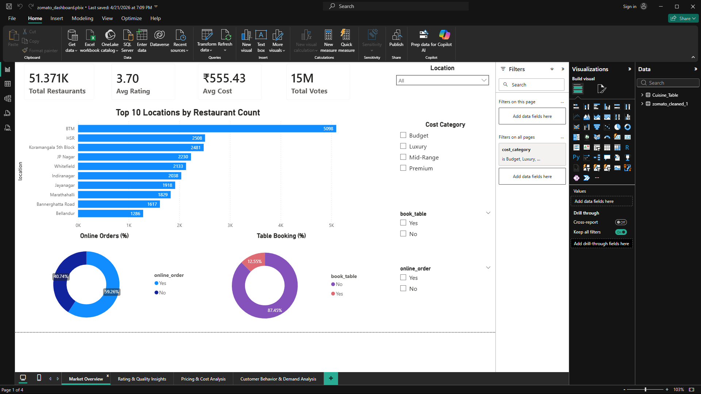
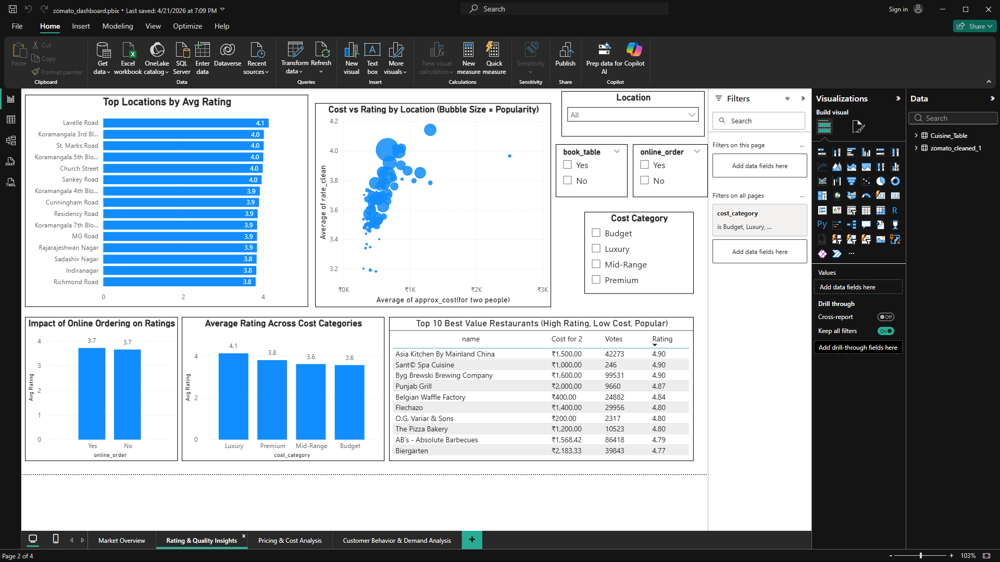
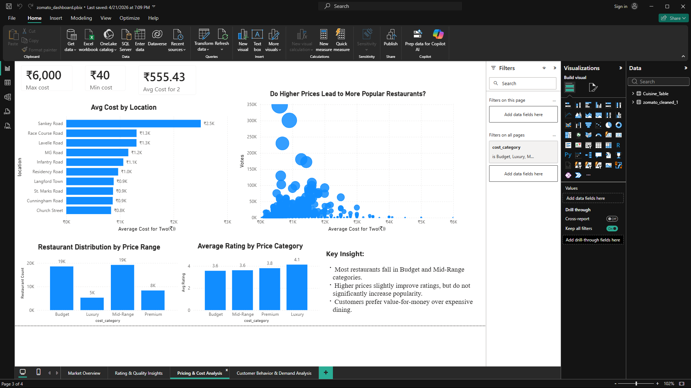
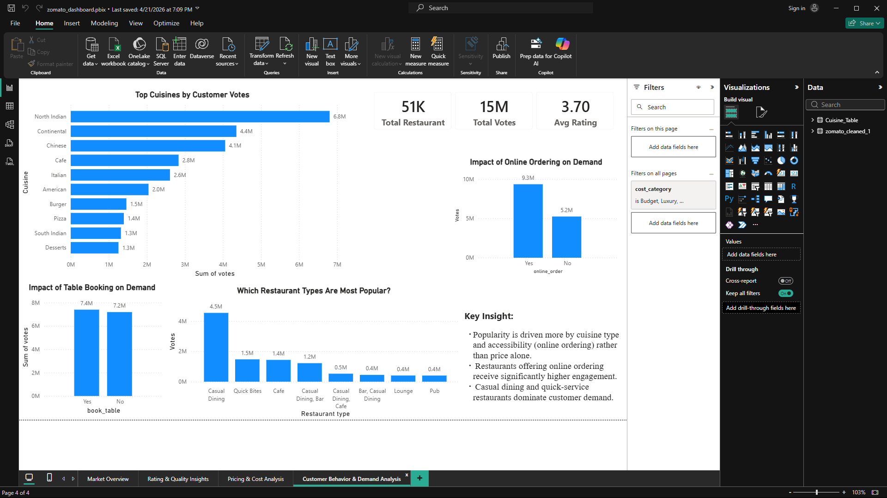

# 🍽️ Zomato Bangalore Data Analysis

## 📌 Overview
This project analyzes restaurant data from Zomato Bangalore to understand customer behavior, pricing trends, and restaurant performance.

---

## 🛠️ Tech Stack
- Python (Pandas, NumPy, Seaborn, Matplotlib)
- SQL (MySQL)
- Power BI

---

## 🔍 Key Steps

### 1. Data Cleaning (Python)
- Removed invalid ratings ("NEW", "-")
- Converted ratings to numeric format
- Cleaned cost column and handled missing values
- Created cost categories (Budget, Mid, Premium, Luxury)

### 2. Data Analysis (SQL)
- Top locations by rating
- Popular cuisines
- Online order impact
- Cost vs rating analysis

### 3. Dashboard (Power BI)
Built a 4-page interactive dashboard:

---

## 📊 Dashboard Pages

### 🔹 Page 1: Market Overview

### 🔹 Page 2: Rating & Quality Insights

### 🔹 Page 3: Pricing Analysis

### 🔹 Page 4: Customer Behavior

---

## 📈 Key Insights
- Mid-range restaurants dominate the market
- Cost has moderate impact on ratings
- Online ordering has minimal effect on ratings
- Certain cuisines drive majority of customer demand

---

## 📂 Project Structure

- `resources/` → Dataset & Power BI dashboard links
- `notebooks/` → Python analysis
- `images/` → Dashboard screenshots
- `README.md` → Documentation
- `requirements.txt` → Dependencies
---

## 🚀 Outcome
This project demonstrates end-to-end data analysis:
- Data cleaning
- Exploratory analysis
- SQL validation
- Dashboard storytelling
